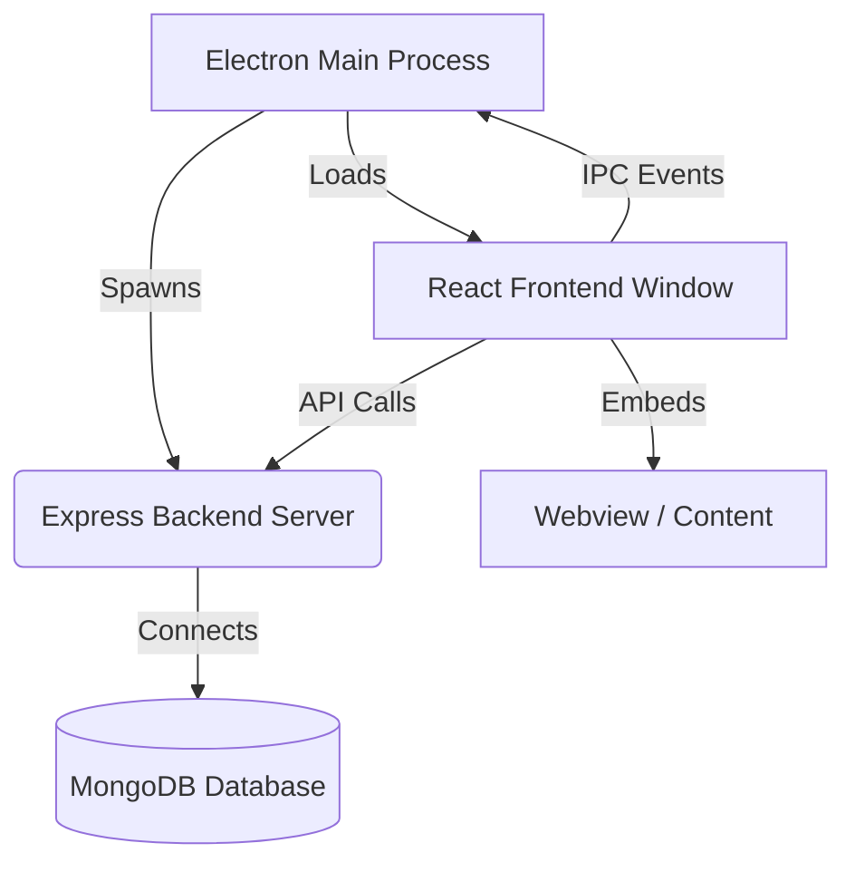

# Atlas Browser

**Atlas Browser** is a custom-built, modern web browser application developed using **Electron** and **React**. Unlike standard browser shells, Atlas integrates a full-stack architecture with a dedicated **Express.js** backend spawned directly alongside the application to handle user authentication, data synchronization, and persistence (History, Bookmarks, Settings) via **MongoDB**.

## 🚀 Key Features

* **Custom Browser Engine**: Utilizes Electron's `<webview>` tag for secure, isolated web content rendering with zoom capabilities and user-agent management.
* **Frameless UI**: A completely custom user interface with dedicated window controls (Minimize, Maximize, Close) and a sleek, modern aesthetic.
* **User Profiles & Sync**: Built-in authentication system allowing users to log in, save, and sync their browsing data.
* **Smart Search**: Integrated address bar featuring a custom **CORS-bypassing proxy** (`/api/suggestions`) that securely fetches real-time Google Search suggestions via the backend.
* **Comprehensive Data Management**:
    * **History**: Tracks and stores browsing history in a database.
    * **Bookmarks**: Save and manage favorite sites.
    * **Shortcuts**: Quick-access links on the Start Page.
    * **Tabs**: Session and tab state management.
* **Settings Persistence**: User preferences are stored and loaded upon login.
* **Hybrid Web/Desktop Mode**: Includes fallback support for running in a standard web browser (via `iframe`) for development purposes, with detection for Electron environments.

## 🏗 Architecture

Atlas Browser employs a unique multi-process architecture:

1.  **Electron Main Process**: Manages application lifecycle and spawns the backend using `child_process.fork()`, ensuring the API server runs as a separate, non-blocking process (`PID` tracked for cleanup).
2.  **Child Backend Process**: A standalone Node.js/Express server running on port 5000. It handles all database operations and acts as a proxy for external APIs to avoid CORS issues in the renderer.
3.  **React Renderer**: The UI layer that communicates with the backend via REST APIs and the Main Process via a secure `ContextBridge` in `preload.js`.
    *   **IPC Channels**: Exposes protected methods like `electron.minimize`, `electron.maximize`, and `electron.close` to the frontend without enabling full Node.js integration.



## 🛠 Tech Stack

### Frontend & Desktop

* **Electron**: Desktop wrapper and main process management.
* **React**: UI library for the browser interface (Address bar, Tabs, Settings).
* **Lucide React**: Iconography.
* **CSS**: Custom styling for components.

### Backend & Data

* **Node.js & Express**: API server handling auth and user data.
* **MongoDB & Mongoose**: Database for storing Users, History, Bookmarks, and Settings.
* **Bcryptjs**: Password hashing and security.
* **Helmet & CORS**: Security middleware.

## 📂 Project Structure

```text
root/
├── Backend/                 # Express Server Logic
│   ├── controllers/         # Auth, Sync, and User logic
│   ├── models/              # Mongoose Schemas (User, History, Bookmark, etc.)
│   ├── routes/              # API Endpoints
│   └── server.js            # Backend entry point
├── public/
│   ├── electron.js          # Electron Main Process & Native Handlers
│   └── preload.js           # Context Bridge for IPC
├── src/
│   ├── components/          # React UI (BrowserView, AddressBar, Tabs, etc.)
│   ├── contexts/            # Global State (Auth, Browser)
│   ├── hooks/               # Custom hooks (useSearchSuggestions)
│   ├── services/            # API communication logic
│   ├── styles/              # Component-specific CSS
│   └── utils/               # Helpers (URL parsing, suggestions)
└── package.json             # Dependencies and Scripts
```

## ⚡ Getting Started

### Prerequisites

* Node.js (v16+)
* MongoDB (Local instance or Atlas Connection URI)

### Installation

1. **Clone the repository:**
```bash
git clone https://github.com/youssef-sabri/webbrowser.git
cd webbrowser
```

2. **Install Dependencies:**
```bash
npm install
```

3. **Environment Setup:**
Create a `.env` file in the `Backend` directory:
```env
PORT=5000
MONGO_URI=mongodb://localhost:27017/atlas-browser
# Add other JWT or Auth secrets as required by authController
```

### Running the Application

To run the React frontend and the Electron shell concurrently (which also auto-spawns the backend):

```bash
npm run electron:dev
```

*This command uses `concurrently` to start the React dev server, waits for it to load, and then launches the Electron application.*

## 🔒 Security

*   **Context Isolation (`contextIsolation: true`)**: Strictly separates the internal Electron API from the web content, preventing malicious scripts from accessing native Node.js primitives.
*   **Webview Isolation**: All browsing content is rendered inside a `<webview>` tag, ensuring that user-loaded pages run in a separate process from the browser UI itself.
*   **Secure IPC**: Communication between the UI and Main Process is limited to a specific set of allowed actions defined in `preload.js`.
*   **Backend Hardening**: Uses **Helmet** middleware to set secure HTTP headers. *Note: `contentSecurityPolicy` is explicitly disabled to allow the proxying of search suggestions from external domains.*
*   **Proxy Search**: Search suggestions are routed through the local backend to avoid CORS issues and prevent direct exposure of the client to third-party suggestion APIs.
